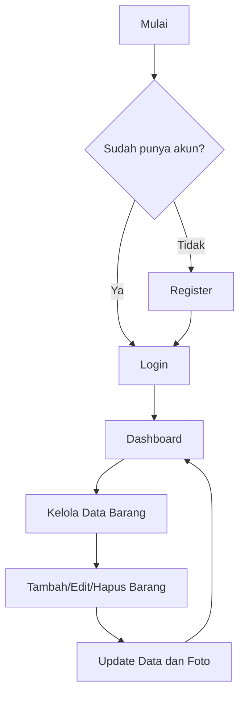

# Alur Pembuatan Laporan Proyek

## Judul Proyek

Sistem Informasi Inventaris Laboratorium Berbasis Laravel 12

## Identitas

- Nama Mahasiswa: ...
- NIM: ...
- Kelas: ...
- Mata Kuliah: ...
- Dosen Pengampu: ...
- Tanggal Pengumpulan: ...

---

## 1. Pendahuluan

### 1.1 Latar Belakang

Jelaskan masalah yang ingin diselesaikan.
Contoh inti pembahasan:

- Pengelolaan inventaris laboratorium masih manual.
- Sulit memantau stok menipis dan kondisi barang.
- Dibutuhkan sistem terkomputerisasi agar data lebih rapi dan cepat diakses.

### 1.2 Rumusan Masalah

Tuliskan dalam bentuk poin:

- Bagaimana membuat sistem login dan register pengguna?
- Bagaimana membuat CRUD data inventaris?
- Bagaimana menangani upload foto barang?
- Bagaimana menampilkan fungsi utama monitoring stok dan kondisi barang?

### 1.3 Tujuan

- Membangun aplikasi inventaris laboratorium berbasis framework Laravel.
- Menerapkan autentikasi pengguna.
- Menerapkan pengelolaan data barang (tambah, ubah, hapus, lihat).
- Menyediakan dashboard informatif untuk monitoring.

### 1.4 Manfaat

- Mempermudah pendataan barang laboratorium.
- Membantu kontrol stok dan kondisi barang.
- Mempermudah pengambilan keputusan pengadaan/perbaikan.

---

## 2. Landasan Teori

### 2.1 Framework Laravel

Ringkas tentang Laravel dan alasan pemilihan.

### 2.2 Konsep CRUD

Definisi Create, Read, Update, Delete.

### 2.3 Autentikasi

Konsep login, register, session, dan middleware auth.

### 2.4 Upload File

Konsep penyimpanan file dan validasi format ukuran file.

### 2.5 Database Relasional

Jelaskan tabel users dan items serta relasinya.

---

## 3. Analisis Kebutuhan

### 3.1 Kebutuhan Fungsional

- User dapat register.
- User dapat login/logout.
- User dapat tambah data barang.
- User dapat lihat daftar barang.
- User dapat edit data barang.
- User dapat hapus data barang.
- User dapat upload foto barang.
- User dapat melihat dashboard monitoring inventaris.

### 3.2 Kebutuhan Non-Fungsional

- Sistem berjalan di browser.
- Menggunakan MySQL sebagai database.
- Tampilan sederhana dan mudah digunakan.

---

## 4. Perancangan Sistem

### 4.1 Arsitektur Singkat

- Frontend: Blade + Bootstrap
- Backend: Laravel (Controller, Model, Route)
- Database: MySQL

### 4.2 Desain Database

Tuliskan struktur tabel penting:

#### Tabel users

- id
- name
- email
- password
- created_at
- updated_at

#### Tabel items

- id
- user_id
- kode_barang
- nama
- kategori
- lokasi
- jumlah
- kondisi
- foto
- deskripsi
- created_at
- updated_at

### 4.3 Alur Sistem

1. User melakukan register atau login.
2. Setelah login, user masuk ke dashboard.
3. User mengelola data barang melalui menu Data Barang.
4. Sistem menyimpan foto barang ke storage.
5. Dashboard menampilkan ringkasan stok menipis, stok habis, dan barang rusak.

### 4.4 Diagram Alur (Opsional)

---

## 5. Implementasi

### 5.1 Persiapan Lingkungan

- Install PHP, Composer, Node.js, MySQL.
- Clone project.
- Konfigurasi file env (DB database: inventaris).
- Jalankan migration.

### 5.2 Implementasi Fitur

#### A. Login dan Register

Jelaskan route, controller, dan halaman login/register yang dibuat.

#### B. CRUD Barang

Jelaskan proses tambah, tampil, edit, hapus data barang.

#### C. Upload Foto Barang

Jelaskan validasi file, penyimpanan di storage, dan penampilan pada halaman data.

#### D. Main Function Dashboard

Jelaskan metrik yang ditampilkan:

- Total barang
- Total unit
- Stok menipis
- Stok habis
- Barang rusak
- Rekomendasi tindak lanjut

### 5.3 Tampilan Antarmuka

Tambahkan screenshot:

- Halaman Login
- Halaman Register
- Dashboard
- Halaman Data Barang
- Form Tambah Barang
- Form Edit Barang

Gunakan format:

- Gambar 1. Halaman Login
- Gambar 2. Dashboard
- dan seterusnya.

---

## 6. Pengujian Sistem

### 6.1 Skenario Uji

Buat tabel uji seperti berikut:

| No  | Fitur         | Langkah Uji                   | Hasil Diharapkan       | Hasil Aktual | Status      |
| --- | ------------- | ----------------------------- | ---------------------- | ------------ | ----------- |
| 1   | Register      | Isi form register valid       | Akun berhasil dibuat   | ...          | Lulus/Gagal |
| 2   | Login         | Masukkan email/password benar | Masuk dashboard        | ...          | Lulus/Gagal |
| 3   | Tambah Barang | Isi form tambah barang        | Data tersimpan         | ...          | Lulus/Gagal |
| 4   | Upload Foto   | Upload file JPG/PNG <= 2MB    | Foto tersimpan         | ...          | Lulus/Gagal |
| 5   | Edit Barang   | Ubah data barang              | Data terbarui          | ...          | Lulus/Gagal |
| 6   | Hapus Barang  | Hapus data                    | Data terhapus          | ...          | Lulus/Gagal |
| 7   | Dashboard     | Buka dashboard                | Ringkasan tampil benar | ...          | Lulus/Gagal |

### 6.2 Hasil Pengujian

Simpulkan apakah semua fitur berjalan sesuai kebutuhan.

---

## 7. Kesimpulan dan Saran

### 7.1 Kesimpulan

Contoh poin:

- Sistem berhasil dibangun menggunakan Laravel.
- Semua requirement utama terpenuhi (auth, CRUD, upload, main function).
- Dashboard membantu monitoring inventaris secara informatif.

### 7.2 Saran Pengembangan

- Tambah fitur pencarian dan filter lanjutan.
- Tambah export laporan PDF/Excel.
- Tambah role admin dan petugas laboratorium.
- Tambah histori transaksi keluar-masuk barang.

---

## 8. Daftar Pustaka

Contoh format:

1. Dokumentasi Laravel. https://laravel.com/docs
2. Dokumentasi Bootstrap. https://getbootstrap.com/docs
3. Referensi lain sesuai yang digunakan.

---

## Checklist Sebelum Submit

- Judul dan identitas lengkap.
- Semua bab terisi.
- Screenshot antarmuka sudah dimasukkan.
- Tabel pengujian sudah diisi hasil aktual.
- Kesimpulan sesuai hasil implementasi.
- File laporan sudah rapi dan konsisten.
